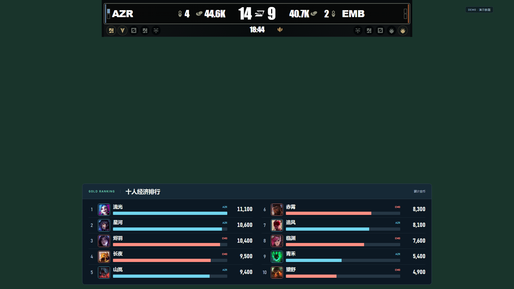
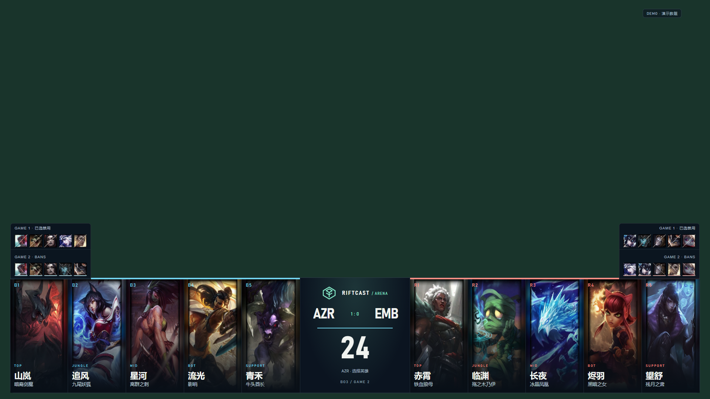
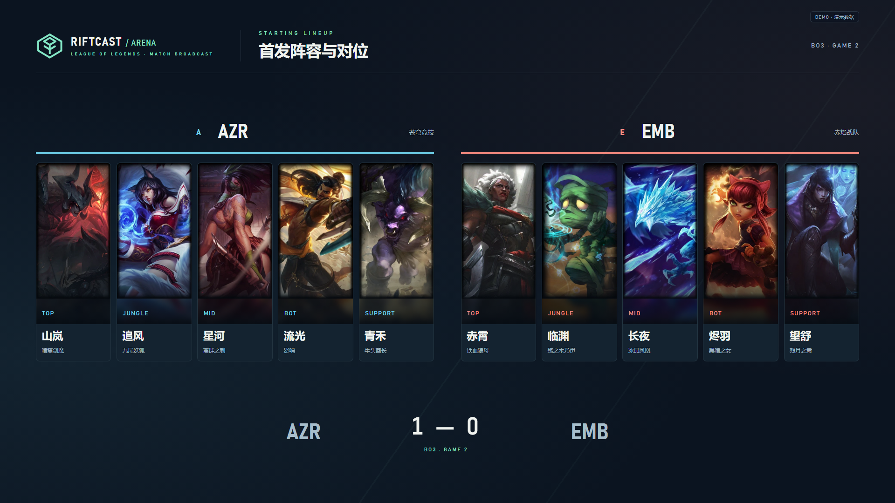

# 2026-10-05 更新验收

本次包含五组选手画面切换、全部英雄本地原画素材以及十人累计经济排行。旧版蓝、红两侧素材迁移到打野组；旧版经济来源节目迁移到十人排行。操作入口和数据语义分别见 [底部计分板](局内底部计分板.md)、[英雄原画素材](英雄原画素材.md)、[十人经济排行](十人经济排行.md)。

已完成的验证：

- 202 项服务测试通过，覆盖既有局内 API、OCR、OBS、归档行为，以及新增五组配置、迁移、5 秒服务端轮播、手动中断、经济有效期和全场降序排名。
- 类型检查与 Vite 生产构建通过。
- 173 位英雄共 519 个本地文件逐一通过 SHA-256、尺寸及完整 WebP 解码检查。
- 隔离浏览器检查通过：保存五组独立素材、逐组手动切入与姓名同步、完整 25 秒自动轮播、手动中断、摄像头设备配置、前五左列/后五右列、头像/金币数字、所有 173 位英雄在 BP 和首发两个节目中加载正确尺寸的本地原画。
- 已查看四张全英雄双画幅图集，以及 BP、首发、经济榜完整节目预览。

这些检查使用演示数据、隔离 HTTP 状态和模拟摄像头 RPC。真实游戏画面合成、物理摄像头切换延时、现场 OCR 以及实际直播接收端效果未在此次验证中测量。

演示节目预览：

