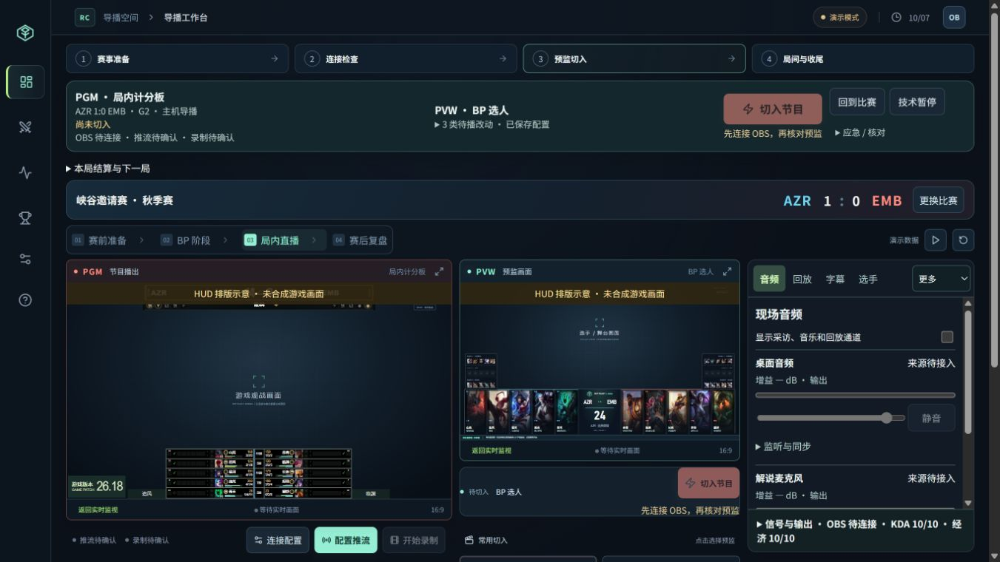
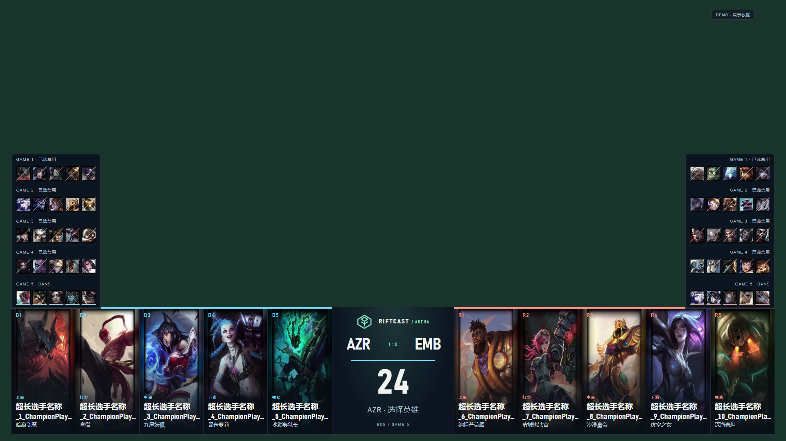

# RiftCast 0.4.0 · 前端改进与发布验收

日期：2026-10-07。上一版本：`v0.3.0` / `35455af`。修改依据：[0.3.0 前端呈现评审](前端呈现评审与修改建议-0.3.0-2026-10-07.md)。

本版整理了导播工作台、BP、数据、赛事与素材、连接与输出、赛后收尾、移动席位和全部 11 种节目包装。跨页固定栏显示节目身份、待播内容、引擎应用状态、输出状态和控制席；音频、回放、字幕、选手画面在工作台右侧切换。数据与画面检查沿用隔离演示环境。

## 使用上的变化

1. 在「赛事与素材」准备对阵和名单；在「连接与输出」的「数据 / 画面 / 声音 / 输出 / 包装 / 诊断与协作」完成对应配置。桌面端提供本机路径选择器和日志入口。
2. 编辑表单时先保存到待播，再核对 PVW，使用「切入节目」。固定栏会区分请求接收、OBS 已应用和人工画面核对；未连接 OBS 时按钮给出禁用原因。`Ctrl+Enter` 使用实际配置的快捷键，工作台继续支持 `Enter`。
3. 需要临场控制时，在右侧选择音频、回放、字幕或选手；「更多」可进入顺序、暂停与结果、镜头、检查、包装、席位。增益、静音及应急动作直接影响引擎，普通资料与包装编辑进入待播。
4. BP 当前轮次与槽位在页面前部；英雄选择使用侧边面板。最终归属按蓝红队伍列出，可以选择队友交换英雄，交换后重新锁定。后台页面保留本地草稿；关闭窗口或刷新会结束本次未保存编辑。
5. 赛后按胜方、终局数据、报告核对、录像、下一步逐项处理。报告确认绑定当前节目版本；录像匹配系列赛、局号和重赛次数。

## 评审条目对应

| 编号 | 0.4.0 实现 |
| --- | --- |
| F01 | 全局固定 PGM/PVW、系列赛比分、局号、控制席、推流/录制摘要与应急操作；工作台任务区与监视器并排。 |
| F02 | 本地草稿、已保存待播、切入请求、OBS 应用、人工核对分开表达；待播摘要按场景、资料、字幕、包装等类别比较，排除遥测和轮播计时。 |
| F03 | 提示按成功、信息、警告、错误、处理中分型；错误保留并可关闭，OBS 断开错误转为中文；移除提前宣布切入成功的提示。 |
| F04 | 控制台独立字号、间距、颜色和焦点变量；常用控制使用可读字号，PGM/PVW 保留文字标签；关键操作与危险操作外观分开。 |
| F05 | 工作台、BP、管理、设置切页保留组件草稿；设置、包装、底部画面和归属编辑保护配置版本，冲突保留输入并提供核对与合并入口。 |
| F06 | 各页面切入使用公共 TakeControl 和统一服务端动作；显示权限、连接和处理中的禁用原因；按住操作有进度与键盘支持。 |
| F07 | 连接与空数据状态说明原因和下一步；可切换带说明的 HUD 排版示意；英雄、队标、首发照片读取失败采用文字或英雄图回退。 |
| F08 | 标签支持方向键、Home/End，场景缩略图内容不重复朗读；选择英雄支持 Escape 和焦点返回，新增控件有名称与可见焦点；减少动态效果偏好适用于排名动画。 |
| P01 | 节目、预监与临场任务形成三列；1366×768 可直接到达四类常用任务与固定切入、回比赛、技术暂停。 |
| P02 | 场景按阶段筛选，可设常用并调整顺序；低高度显示紧凑卡片。播单可重排、编辑时长、预备、切入，并人工标记已播。 |
| P03 | 桌面与解说为常用通道，其他通道展开；电平、增益和静音独立显示，加入 3.5 秒峰值保持。滑块显示目标值并保留拖动中的输入。 |
| P04 | 独立片段按当前对局/全部筛选，保留游戏监视；入出点可拖动或输入，编辑后需保存再预监，播放进度读取 OBS 媒体游标；回比赛入口固定可达。 |
| P05 | 字幕有模板、500 字限制、当前节目对照、待播保存和即时播出/撤下；即时操作按控制席权限限制。 |
| P06 | 暂停、重赛和修订分别维护理由；展示暂停类型和经过时间、结果目标战队、比分与修订对象，保留按住保护。 |
| P07 | 设置按六个任务标签组织，配置引导可进入对应任务；画面预览仅在需要时工作，推流配置和密钥继续使用独立临时表单。 |
| P08 | OCR 增加游戏采样图、框选移动/缩放及区域放大；百分比放在高级项；Replay 诊断显示状态、原因和下一步。 |
| P09 | BP 槽位前置，规则折叠；手工/差异入口常驻；客户端差异逐槽显示图片与名字，最终归属分队编辑并支持交换。 |
| P10 | 十人表默认首屏，支持分队、对位、升降序、可选列与冻结选手列；概览经济图可悬停，事件和采集状态单独查看。 |
| P11 | 比赛标记准备/节目身份，编辑区自动聚焦；显示照片与本场账号匹配数量；日期时间统一输入，载入操作展示目标双方。 |
| P12 | 图片分类、搜索、批量导入、上传进度、尺寸比例、棋盘格透明预览、待播/节目引用和构图预览；英雄库显示资源版本与数量。 |
| P13 | 五组对位缩略图、PGM/PVW 对照、轮播倒计时与保持原因；照片水平/垂直焦点可保存。底部配置先入待播，切入后应用摄像头。 |
| P14 | 五步收尾卡、下一局阻塞原因、带战队名的胜方确认；记录按系列赛/局号/尝试排序，显示冻结、缺失、作废、修订和视频索引。 |
| P15 | 手机显示席位、控制者、PGM/PVW 内容与待播数量；按角色提供任务，底部固定切入及限制原因；新移动席默认资料权限。 |
| P16 | 指南提供任务入口、实际快捷键、故障处理与显示方式说明；加载状态和桌面帮助菜单更新，提供日志与路径选择。 |
| B01 | 倒计时未设置与结束分别显示“比赛即将开始”“等待比赛开始”，保持赛事/对阵层级并处理长标题。 |
| B02 | 当前选择槽位突出，选择顺序、归属及预选分开；历史按 BO 长度预留 GAME 1–4，当前局禁用位置固定。 |
| B03 | 首发队标与名字增大，长姓名多行显示；统一照片裁切与渐变，缺失照片回退英雄图。 |
| B04 | 底部姓名、KDA/CS 字号调整，版本区域采用 ARENA 色彩；无素材时保留简洁姓名信息，游戏属性区与小地图遮挡范围沿用原位置。 |
| B05 | 团战节目保持全透明空覆盖层；原生观战提示留在操作员界面，回比赛操作持续可达。 |
| B06 | 十人全场排序增加 1–5 / 6–10 阅读方向、队伍与时间；稳定缺失行、排名位移动画及 reduced-motion；字幕开启时避让底栏。 |
| B07 | 曲线按领先方分段着色，穿零交点正确拆分；超过 30 秒的间隔和时间回退留空，显示最新样本；控制台附悬停和事件。 |
| B08 | 场景卡及监视器名称显示“十人数据榜”或具体焦点选手；保持核心数据与缺失值表达。 |
| B09 | 赛程支持全部、接下来、北京时间比赛日筛选和四场分页，节目显示页码及总数；由导播保存待播并切入。 |
| B10 | 冻结报告展示本局确认胜方、系列赛比分和终局数据状态；修订仍需准备和切入。 |
| B11 | 采访姓名、战队、角色、主题和左右停靠独立编辑，并提供安全区示意；名牌与底部字幕保持间距。 |
| T01 | 控制台与观众样式分别作用域；公共通知、标签、空状态、保存条、切入控件统一，新增复杂组件使用可读格式。 |
| T02 | 大型制作面板按音频、回放、暂停、字幕、检查、席位等组件拆分，表单状态分开；页面位置由 URL hash 恢复。 |
| T03 | 管理/设置/BP/数据按需加载；场景缩略图和监视器在不可见时暂停工作；节目继续使用原生投影、普通监视使用每秒 1 帧快照。 |

## 已做检查

- `npm test`：242 项通过，包含新增的待播比较、切入条件、曲线断点、分页、配置兼容与峰值保持检查。
- `npm run build`：TypeScript 与生产构建通过。入口 JavaScript 由 512.24 kB 降到 446.56 kB，gzip 由 153.21 kB 降到 135.63 kB；页面包按需加载。全部 CSS 合计约 252.18 kB，包含按需页面样式。运行时 CPU/GPU 与真实输出帧率须在目标机器测量。
- `npm run verify:production`：15 项生产构建/隔离 HTTP 流程通过，覆盖保存隔离、离线禁用、旧表单拒绝、编辑快捷键保护、长按、跨页 BP 草稿、页面宽度、11 场景及 4 类移动席位。
- `npm run verify:broadcast-controls`：7 组检查通过，覆盖五组素材、5 秒轮播、摄像头配置、十人排序、173 位英雄实际解码，以及长名称、缺失图、GAME 5、经济断点和赛程第三页。
- `node scripts/verify-director-workflow.mjs`：13 组回归通过，覆盖单个原生节目窗口的模拟桥接、切页释放、每秒快照、快捷键单次触发、推流目标临时表单清空、断线后重新确认、冻结报告和下一局流程。引擎输出状态采用 mock。
- `npm run verify:champion-art`：16.19.1 的 173 位英雄、519 个本地图像验证通过。
- `node scripts/test-obs-projector-helper.cjs`：原生辅助程序的所有权拒绝、数值参数、本地化身份与只读枚举检查通过；Electron 主进程及 preload 语法检查通过。
- 手动浏览器检查：1366×768 的固定栏和四任务入口、设置/管理跨页草稿、中文错误提示、BP 侧边选择、十人表及 390×844 手机固定栏。另有自动布局覆盖 1080、1366、1920 像素宽度。

可复现脚本位于 `scripts/`，需要通过 `RIFTCAST_PLAYWRIGHT_MODULE` 提供 Playwright。过程报告和完整截图位于被 Git 忽略的 `verification-output/production-0.4.0/`、`verification-output/frontend-0.4.0/`。这些环境使用专门的演示数据与隔离目录，静态装备/符文元数据可使用空 fixture。

## 界面记录

1366×768 工作台，展示固定播出栏、节目/预监示意和临场音频任务。图中为隔离演示数据，OBS 未连接，HUD 示意未合成游戏画面。

第五局 BP 的长名称和历史禁用压力样例，使用纯色底演示透明游戏区域。

[390×844 手机资料席截图](evidence/frontend-0.4.0/remote-390.png)保留席位权限说明和底部固定操作栏。

## 升级与现场确认

常规入口仍为 `启动导播.vbs`。已有本机目录升级后，可运行 `powershell.exe -ExecutionPolicy Bypass -File .\启动导播.ps1 -Rebuild` 重建并启动。已有 0.3.0 配置可读取；裁切焦点、采访和赛程配置均有旧数据默认行为。

停播维护时备份自己的 `data` 目录后更新源码。需要恢复时，从 `v0.3.0` 单独检出一个目录，安装依赖并使用备份数据演练；确认前避免两个服务共同写入同一份赛事数据。

本轮未启动真实 OBS、真实比赛或平台推流，也未连接摄像头/麦克风。真实 GPU 合成、物理设备、移动设备触控、Windows 125%/150% 缩放、200% 文字缩放、完整读屏及对比度审计，需要在现场环境继续核对。原生投影的模拟桥接结果与真实窗口显示分别记录。现场仍按 [验收清单](验收.md) 完成画面、声音、终局与平台接收演练。
